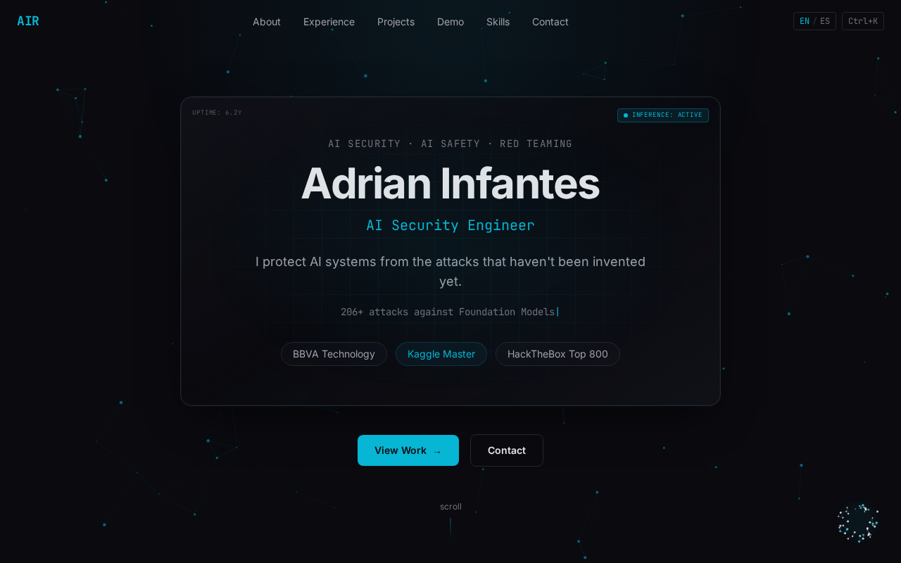
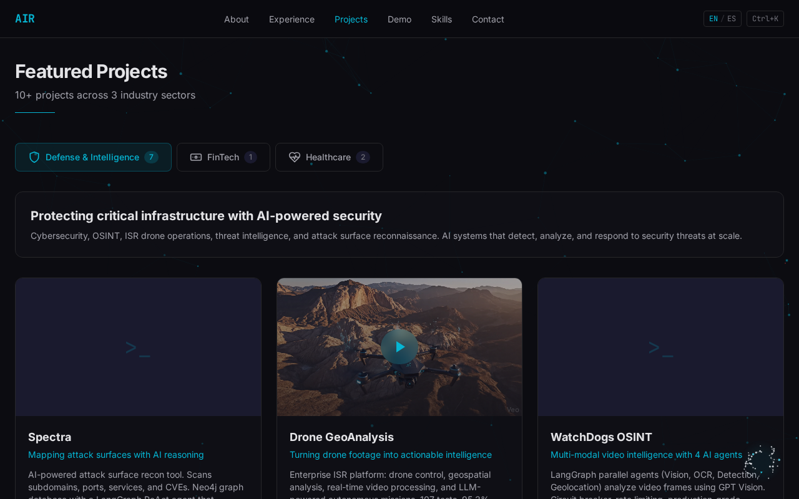
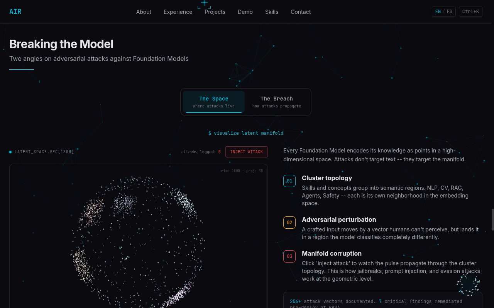
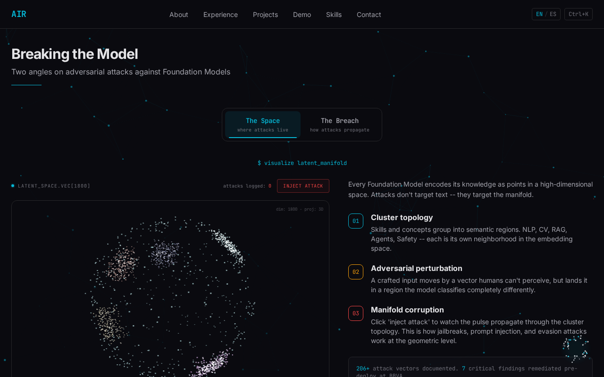
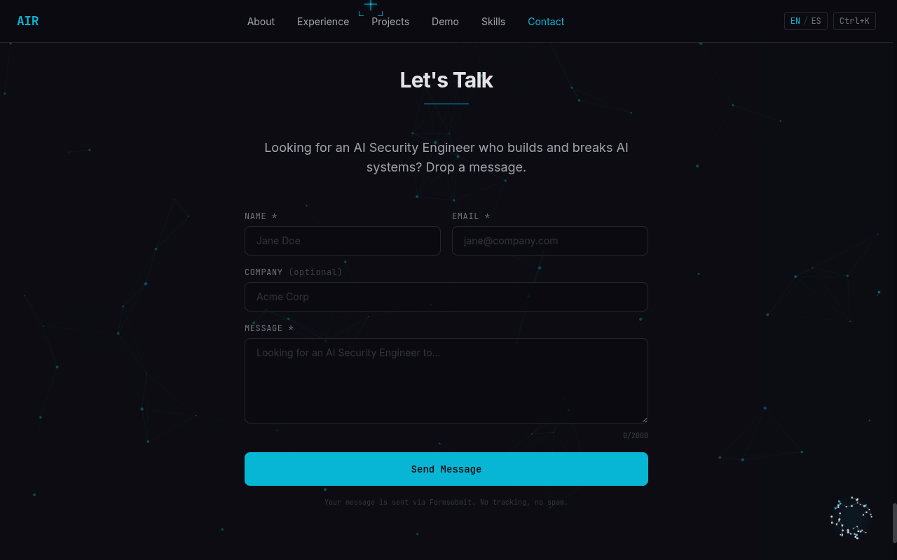

# Adrian Infantes -- AI Security Engineer

Personal portfolio showcasing 6+ years of work at the intersection of AI and cybersecurity. Built to impress in 30 seconds: recruiters see credibility, CTOs see engineering depth.

**Live:** [adrian-infantes.vercel.app](https://adrian-infantes.vercel.app)



## Highlights

- **Dual-language** -- English (`/`) and Spanish (`/es/`) with `hreflang` SEO, one-click toggle
- **3D holographic hero card** -- CSS perspective tilt with parallax depth, mouse-tracked glare
- **AI chatbot (ARCA / NULL)** -- dual-persona LLM chat powered by Llama 3.3 70B via Groq streaming; ARCA (professional) and NULL (red-team offensive persona)
- **Live phishing analyzer** -- paste a suspicious email, get an LLM-powered threat breakdown in real time
- **3D Latent Space globe** -- 1800-point interactive embedding cloud (React Three Fiber) with "Inject Attack" button that visualizes adversarial perturbation propagation
- **Neural Breach animation** -- canvas 2D 4-layer neural network breach sequence
- **3D Knowledge Graph** -- interactive skill topology rendered with R3F
- **Particle network background** -- full-page canvas 2D particles, visible across all sections
- **Security scanner cursor** -- custom cursor that detects DOM elements and displays their metadata
- **Dead pixel Easter egg** -- find it and it takes you to `/l4tentnoise`
- **Mini terminal** -- `Ctrl+K` opens a command palette

## Screenshots

### Projects


### Breaking the Model -- Adversarial Attack Explorer


### Live Demo -- Phishing Analyzer


### Contact


## Tech Stack

| Layer | Tech |
|-------|------|
| Framework | Astro 6 (hybrid SSR + static) |
| UI Islands | React 19 + Framer Motion |
| 3D | Three.js + @react-three/fiber |
| Styling | Tailwind CSS 4 |
| LLM | Groq API (Llama 3.3 70B) |
| Analytics | Upstash Redis |
| Forms | Formsubmit.co |
| Deploy | Vercel (Fluid Compute, Node.js 24) |
| i18n | Custom EN/ES routing with hreflang |

## Architecture

```
src/
  components/
    astro/        # Header, Footer, SectionTitle (server)
    react/        # Islands: AIChat, HolographicCard, SkillGraph3D,
                  #   LatentSpaceGlobe, NeuralBreach, AttackExplorer,
                  #   ParticleNetwork, SecurityCursor, MiniTerminal...
  sections/       # Astro page sections (Hero, About, Projects...)
  pages/
    index.astro   # English route
    es/index.astro # Spanish route
    api/          # chat.ts, phishing-analyze.ts, analytics/*
    l4tentnoise.astro # Secret page
  i18n/           # translations.ts, utils.ts
  data/           # education.ts, experience.ts, projects.ts
  lib/            # constants.ts
```

## Local Development

```bash
git clone <this-repo>
cd Web-AIR
npm install
```

Create `.env.local` with:

```
GROQ_API_KEY=your_groq_key
UPSTASH_REDIS_REST_URL=your_upstash_url
UPSTASH_REDIS_REST_TOKEN=your_upstash_token
```

```bash
npm run dev    # http://localhost:4321
npm run build  # production build
```

## License

Copyright (c) 2026 Adrian Infantes Romero. **All rights reserved.**

This software is proprietary. No permission is granted to copy, fork, modify, or redistribute it. See [LICENSE](LICENSE) for full terms.
