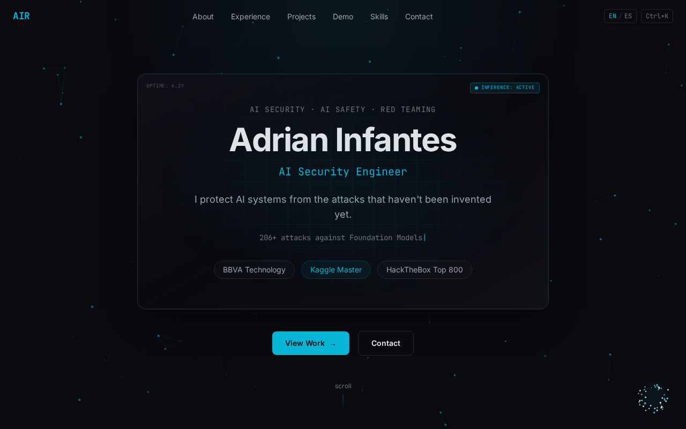
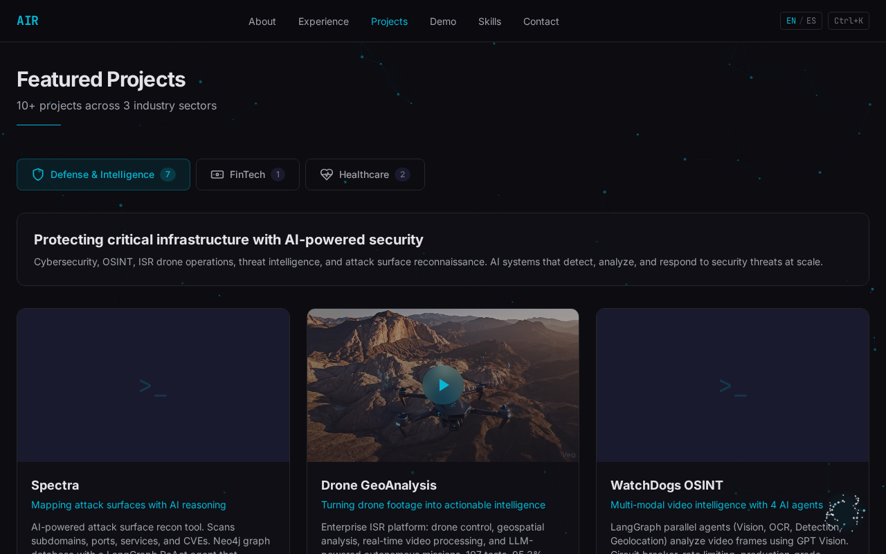
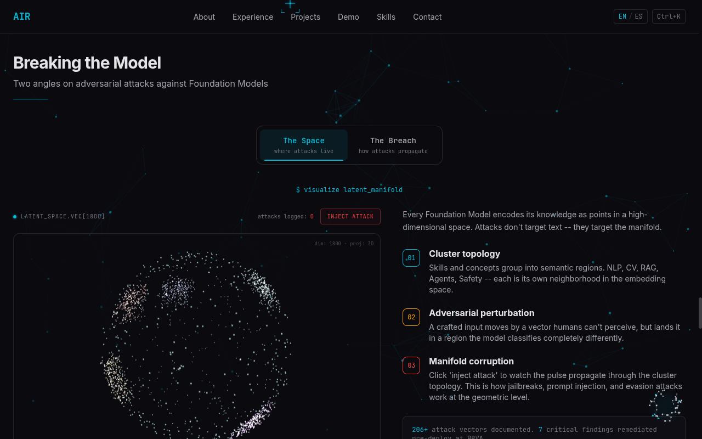
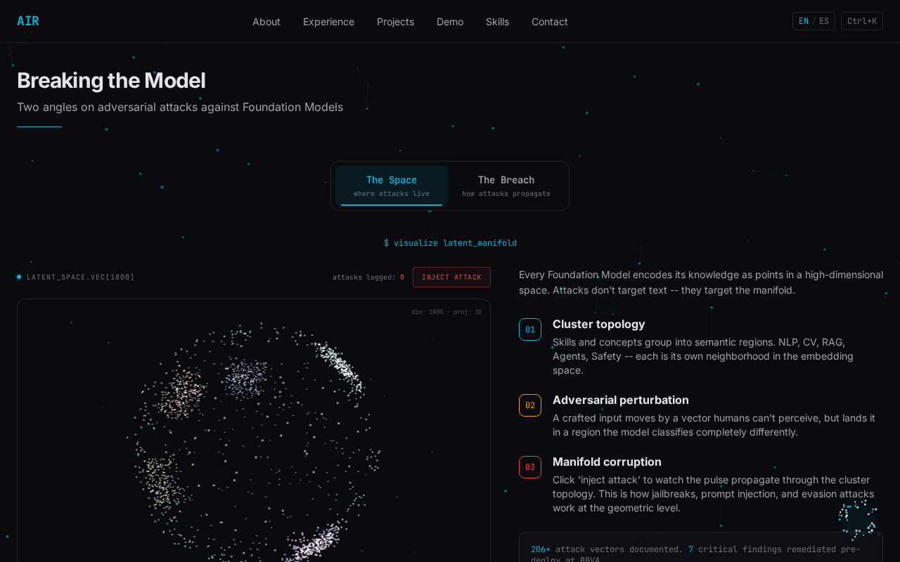
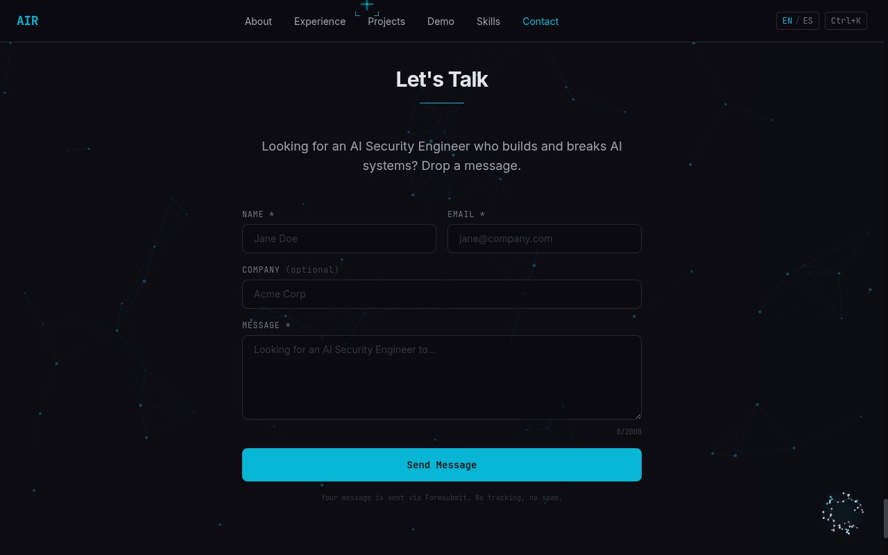

# Adrian Infantes -- AI Security Engineer

Personal portfolio showcasing 6+ years of work at the intersection of AI and cybersecurity. Built to impress in 30 seconds: recruiters see credibility, CTOs see engineering depth.

**Live:** [adrian-infantes.vercel.app](https://adrian-infantes.vercel.app)



## Highlights

- **Dual-language** -- English (`/`) and Spanish (`/es/`) with `hreflang` SEO, one-click toggle
- **Dark experimental identity** — local Clash Display headings, Inter body, JetBrains Mono data and a contained conceptual trust-boundary graph with a pause control.
- **Enterprise case studies** — two Verisure contributions with dated milestones and visible validation limits.
- **Visible project catalog** — selected projects render in HTML; React adds sector filters. Videos load after an explicit action.
- **Laboratory** — `/lab/` and `/es/lab/` contain ARCA, the existing AI/security visualizations, email analyzer, Job Match and optional graphic effects. Interactive modules import when opened.
- **Accessible profile tools** — visible ARCA AI and terminal controls open native dialogs with Escape, focus containment and focus return. Chat and terminal code load on opening.
- **Three home React islands** — project filters, contact form and tool dock. Content sections render without hydration; no 3D module is mounted on home.
- **Roadmap** — existing checklists and browser persistence remain on `/roadmap` and `/es/roadmap`.

## Screenshots

These captures document the previous interface; they have not been regenerated for the current frontend.

### Projects


### Breaking the Model -- Adversarial Attack Explorer


### Live Demo -- Phishing Analyzer


### Contact


## Tech Stack

| Layer | Tech |
|-------|------|
| Framework | Astro 6 (hybrid SSR + static) |
| UI Islands | React 19 + Framer Motion |
| 3D | Three.js + @react-three/fiber |
| Styling | Tailwind CSS 4 |
| LLM | Groq API (Llama 3.3 70B) |
| Analytics | Upstash Redis |
| Forms | Formsubmit.co |
| Deploy | Vercel (Fluid Compute, Node.js 24) |
| i18n | Custom EN/ES routing with hreflang |

## Architecture

```
src/
  components/
    astro/        # Shared HomeContent/LabContent, Header, Footer, SectionTitle
    react/        # Islands: AIChat, SkillGraph3D,
                  #   LatentSpaceGlobe, NeuralBreach, AttackExplorer,
                  #   ParticleNetwork, SecurityCursor, MiniTerminal...
  sections/       # Astro page sections (Hero, About, Projects...)
  pages/
    index.astro   # English route
    es/index.astro # Spanish route
    lab/          # English laboratory
    es/lab/       # Spanish laboratory
    api/          # chat.ts, phishing-analyze.ts, analytics/*
  i18n/           # translations.ts, utils.ts
  data/           # education.ts, experience.ts, projects.ts
  lib/            # constants.ts
```

## Local Development

```bash
git clone <this-repo>
cd Web-AIR
npm install
```

Create `.env.local` with:

```
GROQ_API_KEY=your_groq_key
UPSTASH_REDIS_REST_URL=your_upstash_url
UPSTASH_REDIS_REST_TOKEN=your_upstash_token
```

```bash
npm run dev    # http://localhost:4321
npm run build  # production build
```

## Build Verification

```bash
npm test
npm run build
VERCEL=1 VERCEL_SKEW_PROTECTION_ENABLED=1 VERCEL_DEPLOYMENT_ID=dpl_local_verification npm run build
```

The last build uses a synthetic deployment ID to exercise Vercel's skew-protection rewriting of lazy imports, including `LabModule` and `ToolDock`. A regular local build does not cover this path.

## License

Copyright (c) 2026 Adrian Infantes Romero. **All rights reserved.**

This software is proprietary. No permission is granted to copy, fork, modify, or redistribute it. See [LICENSE](LICENSE) for full terms.
